# Hi 👋, I'm Kawser Ahmad

### A passionate coder,frontend-backend developer, and computer engineering undergrad student from Bangladesh.

	

📫 How to reach me <strong>mdshakil4364@gmail.com</strong>

⚡ Fun fact <strong>There are more possible moves in a game of Chess than there are atoms in the observable universe.</strong>

👨‍💻 All of my projects are available at <strong><a href="https://github.com/rootcode-creator">Github</a></strong>

📝 I regularly write articles on <strong><a href="https://kawserahmed.tech">https://kawserahmed.tech</a></strong>

 

<h3 align="left">Connect with me:</h3>

  
  <a href="https://linkedin.com/in/kawser2017" target="blank" style="display:inline-flex;align-items:center;justify-content:center;width:44px;height:44px;border-radius:12px;background:#0A66C2;box-shadow:0 4px 12px rgba(10,102,194,0.3);"><svg style="width:28px;height:28px;" viewBox="0 0 24 24" fill="white"><path d="M20.447 20.452h-3.554v-5.569c0-1.328-.027-3.037-1.852-3.037-1.853 0-2.136 1.445-2.136 2.939v5.667H9.351V9h3.414v1.561h.046c.477-.9 1.637-1.85 3.37-1.85 3.601 0 4.267 2.37 4.267 5.455v6.286zM5.337 7.433c-1.144 0-2.063-.926-2.063-2.065 0-1.138.92-2.063 2.063-2.063 1.14 0 2.064.925 2.064 2.063 0 1.139-.925 2.065-2.064 2.065zm1.782 13.019H3.555V9h3.564v11.452zM22.225 0H1.771C.792 0 0 .774 0 1.729v20.542C0 23.227.792 24 1.771 24h20.451C23.2 24 24 23.227 24 22.271V1.729C24 .774 23.2 0 22.225 0z"/></svg></a>
  
  
  
  <a href="https://medium.com/rootcode-creator" target="blank" style="display:inline-flex;align-items:center;justify-content:center;width:44px;height:44px;border-radius:12px;background:#000;box-shadow:0 4px 12px rgba(0,0,0,0.3);"><svg style="width:28px;height:28px;" viewBox="0 0 24 24" fill="white"><path d="M13.54 12a6.8 6.8 0 01-6.77 6.82A6.8 6.8 0 010 12a6.8 6.8 0 016.77-6.82A6.8 6.8 0 0113.54 12zM20.96 12c0 3.54-1.51 6.42-3.38 6.42-1.87 0-3.39-2.88-3.39-6.42s1.52-6.42 3.39-6.42c1.87 0 3.38 2.88 3.38 6.42M24 12c0 3.17-.53 5.75-1.19 5.75-.59 0-1.08-2.33-1.09-5.46v-.29c0-3.14.5-5.74 1.09-5.74.66 0 1.19 2.58 1.19 5.75z"/></svg></a>
  
  
	
  
  
  

<h3 align="left">Languages and Tools:</h3>

<table>
	<tr>
		<td align="center"></td>
		<td align="center"></td>
		<td align="center"></td>
		<td align="center"></td>
		<td align="center"></td>
		<td align="center"></td>
		<td align="center"></td>
		<td align="center"></td>
		<td align="center"></td>
		<td align="center"></td>
	</tr>
	<tr>
		<td align="center"></td>
		<td align="center"></td>
		<td align="center"></td>
		<td align="center"></td>
		<td align="center"></td>
		<td align="center"></td>
		<td align="center"></td>
		<td align="center"></td>
		<td align="center"></td>
		<td align="center"></td>
	</tr>
	<tr>
		<td align="center"></td>
		<td align="center"></td>
		<td align="center"></td>
		<td align="center"></td>
		<td align="center"></td>
		<td align="center"></td>
		<td align="center"></td>
		<td align="center"></td>
		<td align="center"></td>
		<td align="center"></td>
	</tr>
	<tr>
		<td align="center"></td>
		<td align="center"></td>
		<td align="center"></td>
		<td align="center"></td>
		<td align="center"></td>
		<td align="center"></td>
		<td align="center"></td>
		<td align="center"></td>
		<td align="center"></td>
		<td align="center"></td>
	</tr>
	<tr>
		<td align="center"></td>
		<td align="center"></td>
		<td align="center"></td>
		<td align="center"></td>
		<td align="center"></td>
		<td align="center"></td>
		<td align="center"></td>
		<td align="center"></td>
		<td align="center"></td>
		<td align="center"></td>
	</tr>
	<tr>
		<td align="center"></td>
		<td align="center"></td>
		<td align="center"></td>
		<td align="center"></td>
		<td align="center"></td>
		<td align="center"></td>
		<td align="center"></td>
		<td align="center"></td>
		<td align="center"></td>
		<td align="center"></td>
	</tr>
</table>

 

<h3 align="left">Stats:</h3>

  
  

 

# Blog posts
<!-- BLOG-POST-LIST:START -->
<!-- BLOG-POST-LIST:END -->
